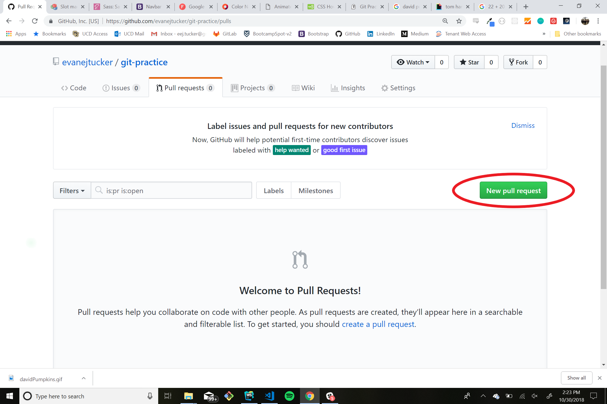

# git-practice

## how to protect the master branch
* Protect the repo's master branch as we did during project 1.

  * Once at the repo's page, click the "Settings" tab.

  * Select "Branches" from the left sidebar.

  * Under "Branch protection rules", choose "master" from the dropdown.

  * Check off the following options:

    * "Protect this branch"

    * "Require pull request reviews before merging"

    * "Include administrators"

    * "Require status checks to pass before merging"

    * "Require branches to be up to date before merging"
  
  * Click "Save changes"

* Once complete, invite the other group members as collaborators.

## steps for git flow

1. clone repo to your computer `git clone https://github.com/evanejtucker/git-practice.git`
2. (optional) install the dependencies `npm install`
    * if you would like to update the SASS, you will need to npm install so you can run the compile commands
3. Create a branch `git checkout -b 'branch-name'`
    * confirm you are in the newely created branch with `git branch`
4. Add code to project
5. Add newely added code and branch to github
    * `git add .`
    * `git commit -m "added code"`
    * `git push origin 'branch-name'`
        * *the reason you push to your branch instead of the master is so you can handle the merge into the master from github*
6. on the github website, create an new pull request from the pull request tab of your repository
   * 
7. Have another contributer review and merge your branch into the master branch.
    * if you have multiple branches to merge into the master, handle all those merges at the same time.
8. In the terminal, navigate back to your local master branch `git checkout master`
    * confirm you are in the newely created branch with `git branch`
9.  pull the changes from the github master branch into your local mater branch `git pull origin master`
10. If you would like to keep working in the same branch you created earlier:
    * `git checkout 'your branch'`
    * `git pull origin master`   
11. or create an new branch and start the process over again.
  